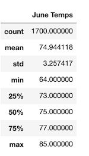
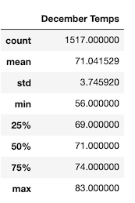

## Project Overview
Before opening our surf and ice cream shops with B. Wavy we have to analyze temperature trends in Oahu specifically in the months of June and December to determine if the endeavor will be sustainable all year-round.

## Resources
- **Software:** SQLite, Flask, Python, Jupyter notebook  
- **Dependencies:** SQLAlchemy, NumPy, Pandas, Matplotlib, Datetime

## Objectives
- Determine the Summary Statistics for June.
- Determine the Summary Statistics for December.
- Use SQLAlchemy to connect to and query a SQLite database.

## June Temperatures in Oahu

## December Temperatures in Oahu

## Results & Summary

### Results

**Three major points and key differences in weather between June and December from our analysis:**

- The highest temperature for June was 85 degrees, the highest temperature for December was 83 degrees.
- On average it is warmer in June than it is in December in Oahu.
- The lowest temperature recorded and analyzed was in December for 56 degrees whereas the lowest temperature in June was 64 degrees.

### Summary

From this data we can gather that it will be a sound business decision to open our surf and ice cream shop in Oahu and it will be sustainable all year. We can also estimate that although there may be a slight decline in revenue during the month of December due to temperatures as low as 56 degrees, there isn't any data suggesting that the surfing conditions will be unsuitable for surfers nor will there necessarily be any conditions that makes purchasing ice cream less favorable.

Two additional inquires that we can make to further analyze our possible business venture's success & sustainability would be to gather data regarding precipitation as well as humidity.
